# ASEA-X: Complete System Documentation

📚 **Table of Contents**

1. [System Overview](#system-overview)
2. [Architecture](#architecture)
3. [Core Components](#core-components)
4. [Agent System](#agent-system)
5. [Execution Engine](#execution-engine)
6. [Safety & Security](#safety--security)
7. [User Interface](#user-interface)
8. [API Reference](#api-reference)
9. [Configuration](#configuration)
10. [Deployment](#deployment)
11. [Troubleshooting](#troubleshooting)
12. [Development Guide](#development-guide)
13. [Contributing](#contributing)
14. [FAQ](#faq)

---

## 1. System Overview

### 1.1 What is ASEA-X?

ASEA-X (Autonomous Software Engineering Agent System) is a multi-agent AI system that can autonomously plan, develop, debug, and manage software projects from start to finish. It combines the power of Large Language Models (LLMs) with a robust agent architecture to create a complete software engineering assistant.


### 1.2 Key Features

- 🤖 **Multi-Agent Architecture**: Specialized agents for planning, development, linting, and debugging.
- 🧠 **LLM-Powered**: DeepSeek integration for intelligent code generation and analysis.
- 🛡️ **Safety First**: Multi-layer safety system with explicit override.
- 📊 **State Management**: Persistent state with Redis support.
- 🔍 **Error Recovery**: Automatic error classification and fixing.
- 📝 **Quality Enforcement**: Mandatory linting and documentation.
- 🔧 **Git Integration**: Atomic commits with conventional messages.
- 🎨 **Rich UI**: Beautiful terminal interface with real-time updates.
- 🔬 **Runtime Monitoring**: Performance tracking and resource monitoring.
- 📚 **Vector DB**: Semantic search for code context.

### 1.3 System Requirements

| Requirement | Minimum | Recommended |
|-------------|---------|-------------|
| Python      | 3.10+   | 3.11+       |
| RAM         | 2GB     | 8GB         |
| Disk Space  | 1GB     | 5GB         |
| CPU         | 2 cores | 4 cores     |
| Network     | Internet for API | High-speed |
| OS          | Linux/Mac/Windows | Linux |

---

## 2. Architecture

### 2.1 High-Level Architecture

```mermaid
graph TB
    subgraph "Presentation Layer"
        CLI[CLI Interface]
        TUI[Terminal UI]
        API[REST API]
    end
    
    subgraph "Agent Layer"
        OA[Orchestrator]
        PA[Planner]
        DA[Developer]
        LA[Linter]
        DBA[Debugger]
    end
    
    subgraph "Core Layer"
        SM[State Manager]
        MM[Mode Manager]
        SS[Safety System]
        LM[LLM Manager]
    end
    
    subgraph "Execution Layer"
        CE[Command Executor]
        RM[Runtime Monitor]
        FM[File Manager]
        GM[Git Manager]
        CL[Context Loader]
    end
    
    subgraph "Data Layer"
        Redis[(Redis)]
        FS[(File System)]
        Vector[(Vector DB)]
    end
    
    CLI --> OA
    TUI --> OA
    API --> OA
    
    OA --> PA
    OA --> DA
    OA --> LA
    OA --> DBA
    
    PA --> SM
    DA --> CE
    DA --> FM
    LA --> CL
    DBA --> RM
    
    SM --> Redis
    FM --> FS
    CL --> Vector
    
    OA --> LM
    LM --> LLM[DeepSeek API]
```



### 2.2 Component Interaction Flow


### 2.3 System Modes


---

## 3. Core Components

### 3.1 State Manager

The State Manager maintains global system state with thread-safe operations and persistence.

**Key Features**:

- Thread-safe operations with RLock
- JSON persistence to disk
- Redis support for distributed mode
- Task queue management
- File context storage

**State Structure**:

```python
{
    "current_mode": "chat",
    "current_task": "task_001",
    "task_history": [...],
    "active_agents": ["planner", "dev"],
    "safety_enabled": true,
    "git_branch": "main",
    "workdir": "./workdir",
    "dependencies_installed": ["pytest"],
    "file_context": {...},
    "last_error": null,
    "execution_count": 42,
    "start_time": 1739600000.0
}
```

### 3.2 Mode Manager

The Mode Manager enforces system modes and valid transitions.

**Mode Transition Rules**:


### 3.3 Safety System

The Safety System prevents dangerous operations with multi-layer checks.

**Safety Layers**:

1. Pattern Detection: Regex patterns for dangerous commands
2. Command Allowlist: Approved commands only
3. Path Traversal Prevention: Blocks .. in paths
4. Resource Limits: CPU/memory/time limits
5. Permission Checks: File operation validation

**Safety Levels**:

```python
SAFE = "safe"           # No restrictions
WARNING = "warning"     # Requires confirmation
DANGEROUS = "dangerous" # Requires override
BLOCKED = "blocked"     # Cannot execute
```

---

## 4. Agent System

### 4.1 Agent Architecture


### 4.2 Agent Communication Protocol


### 4.3 Agent Capabilities Matrix

| Agent      | Code Write | Code Read | Command Exec | File Ops | Planning | Debug | Lint |
|------------|------------|-----------|--------------|----------|----------|-------|------|
| Planner    | ❌        | ✅       | ❌          | ❌      | ✅      | ❌   | ❌    |
| Developer  | ✅        | ✅       | ✅          | ✅      | ❌      | ❌   | ❌    |
| Linter     | ❌        | ✅       | ✅          | ❌      | ❌      | ❌   | ✅    |
| Debugger   | ✅        | ✅       | ✅          | ✅      | ❌      | ✅   | ❌    |

### 4.4 Planner Agent Details

The Planner Agent decomposes ideas into executable tasks.

**Planning Process**:

1. Requirement Analysis: Extract key requirements from user input
2. Project Type Detection: Identify project type (web, CLI, library, etc.)
3. Architecture Design: Create component structure and file layout
4. Task Decomposition: Break down into atomic tasks with dependencies
5. Acceptance Criteria: Define what "done" means

**Task Structure**:

```json
{
  "id": "task_001",
  "description": "Set up FastAPI project structure",
  "estimated_time": 15,
  "priority": 1,
  "dependencies": [],
  "status": "pending",
  "metadata": {
    "files": ["main.py", "requirements.txt"]
  }
}
```

### 4.5 Developer Agent Details

The Developer Agent writes and executes code.

**Development Workflow**:

1. Task Analysis: Understand what needs to be built
2. Dependency Check: Install required packages
3. Code Generation: Write code using LLM
4. File Management: Write files to disk
5. Test Execution: Run tests to verify
6. Error Handling: Pass errors to debugger

**Language Support**:

| Language     | Code Gen | Test | Dependency | Linting |
|--------------|----------|------|------------|---------|
| Python       | ✅        | ✅    | pip        | ruff/black |
| JavaScript   | ✅        | ❌    | npm        | eslint |
| TypeScript   | ✅        | ❌    | npm        | eslint |
| Java         | ✅        | ❌    | maven      | checkstyle |
| Rust         | ✅        | ❌    | cargo      | clippy |
| Go           | ✅        | ❌    | go         | golint |

### 4.6 Linter Agent Details

The Linter Agent enforces code quality.

**Linting Process**:

1. Language Detection: Identify languages in codebase
2. Linter Selection: Choose appropriate linters
3. Execution: Run linters with proper configs
4. Issue Collection: Parse and categorize issues
5. Auto-Fix: Attempt automatic fixes
6. Documentation Check: Verify docstrings/comments

**Linter Configuration**:

```python
LINTER_CONFIGS = {
    "python": {
        "linters": ["ruff", "black", "mypy", "pydocstyle"],
        "auto_fix": ["ruff --fix", "black"]
    },
    "javascript": {
        "linters": ["eslint"],
        "auto_fix": ["eslint --fix"]
    }
}
```

### 4.7 Debugger Agent Details

The Debugger Agent analyzes and fixes errors.

**Error Classification**:

- Syntax Errors: Invalid syntax, indentation issues
- Import Errors: Missing modules, circular imports
- Runtime Errors: Type errors, value errors, attribute errors
- Resource Errors: File not found, permission denied
- Timeout Errors: Execution taking too long
- Test Failures: Assertion errors, test expectations

**Fix Generation Strategy**:

1. Error Analysis: Parse traceback and error message
2. Root Cause: Identify underlying cause
3. Fix Generation: Create multiple fix proposals
4. Risk Assessment: Evaluate each fix (low/medium/high risk)
5. Selection: Choose best fix based on confidence/risk
6. Application: Apply fix and validate

---

## 5. Execution Engine

### 5.1 Command Executor

The Command Executor safely runs system commands with monitoring.

**Execution Flow**:


**Command Result Structure**:

```json
{
  "success": true,
  "command": "python test.py",
  "stdout": "All tests passed!",
  "stderr": "",
  "returncode": 0,
  "execution_time": 2.5,
  "timeout": false,
  "metrics": {
    "cpu_percent": 45.2,
    "memory_mb": 128.5,
    "read_bytes": 1024,
    "write_bytes": 512
  }
}
```

### 5.2 Runtime Monitor

The Runtime Monitor observes program execution with detailed metrics.

**Monitored Metrics**:

- CPU Usage: Percentage over time
- Memory Usage: RSS in MB
- I/O Operations: Read/write bytes
- Thread Count: Number of active threads
- Open Files: File descriptors
- Execution Time: Duration in seconds
- Return Code: Process exit code

### 5.3 File Manager

The File Manager handles all file operations with safety checks.

**Operations**:

- read_file(): Safe file reading
- write_file(): Atomic writes with backup
- copy_file(): Copy with permissions
- delete_file(): Safe deletion with backup
- move_file(): Move with safety checks
- list_directory(): List files with patterns
- search_files(): Content-based search

### 5.4 Git Manager

The Git Manager provides version control integration.

**Features**:

- Repository Init: Auto-initialize if missing
- Atomic Commits: Conventional commit messages
- Branch Management: Create, switch, merge
- Status Tracking: Changed/staged/untracked files
- Diff Generation: Unified diff format
- Commit History: Formatted log display
- Git Hooks: Pre-commit linting

**Commit Message Format**:

```
<type>(<scope>)!: <subject>

<body>

<footer>
```

**Types**: feat, fix, docs, style, refactor, test, chore

---

## 6. Safety & Security

### 6.1 Safety Architecture


### 6.2 Dangerous Patterns

The system blocks these patterns by default:

```python
DANGEROUS_PATTERNS = [
    r'rm\s+-rf\s+',           # Recursive delete
    r'rm\s+-rf\s+/\s*',       # Delete root
    r'dd\s+if=.*\s+of=.*',
